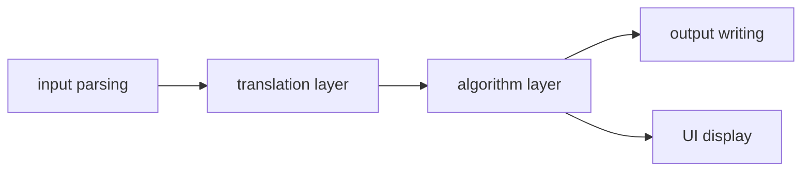

# A graph algorithm problem solver

## Project Motivation
In data structure and algorithm classes, a lot of fancy graph algorithms are covered, such as Fold-Fulkerson algorithms. However, only a few classes require us to implement them. Even though I can practice them through Leetcode, this is not a good way to systematically train graph algorithm implementation. In Leetcode we just need to implement a single function with clear input and output. But in reality we need to decide the appropriate function signature, following the patterns discussed in software engineering.

## Main Features

## Software Architecture

## Reference
- CS61B UCB
- CS170 UCB
- Data structures and algorithms in C++