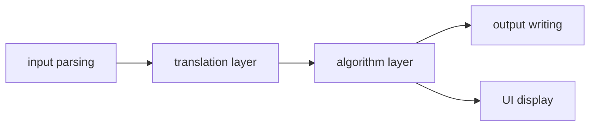

# A graph algorithm problem solver


## Project Motivation
In data structure and algorithm classes, a lot of fancy graph algorithms are covered, such as Fold-Fulkerson algorithms. However, only a few classes require us to implement them. Even though I can practice them through Leetcode, this is not a good way to systematically train graph algorithm implementation. In Leetcode we just need to implement a single function with clear input and output. But in reality we need to decide the appropriate function signature, following the patterns discussed in software engineering.  
To fill the gap between algorithm theory and industrial practice, I developed a tiny graph algorithm solver which takes in jsons and outputs results. Users need to declare the graph type (grid, adjlist etc.), graphical data and queries (is_connected etc.) in the input file. You can also extend the software to accept more queries and graphic types through just adding the functions in the algorithm folder.  
This solver is designed both for research and educational purposes.


## Main Features
1. Accepts graph input in JSON format and loads it into an internal graph structure.
2. Supports basic graph algorithms (e.g., shortest path, traversal, or connectivity checks).
3. Provides a simple command-line interface for input and output files.
4. Outputs results in JSON format for easy post-processing.


## Software Architecture (V1)



## Run the program


``` bash
# configure the project, download the dependencies
cmake -S . -B build

# compile the project
cmake --build build

# add the program to system path
cmake --install build --prefix ~/.local

# example usage
graph_solver input.json output.json
```


## Reference
- CS61B UCB
- CS170 UCB
- Data structures and algorithms in C++